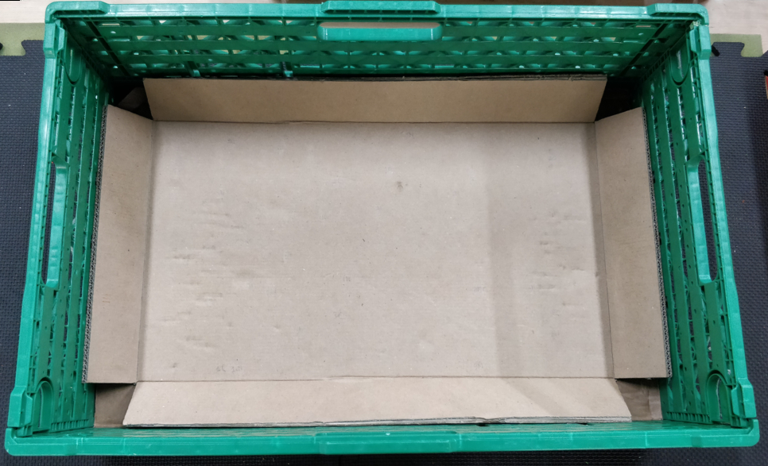
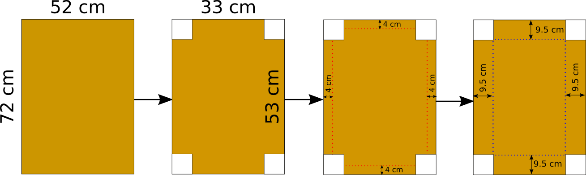
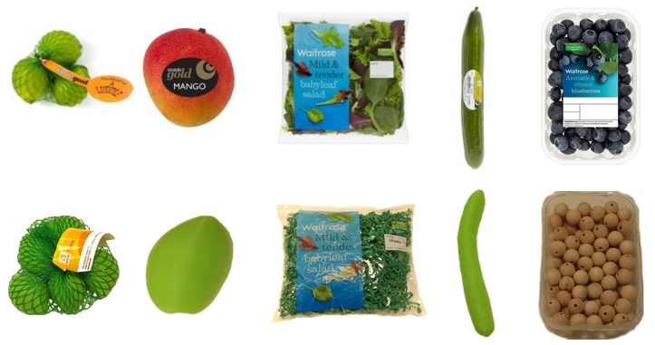
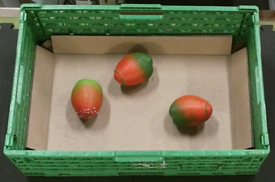
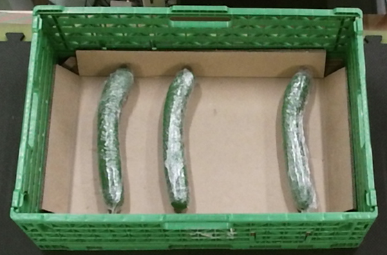
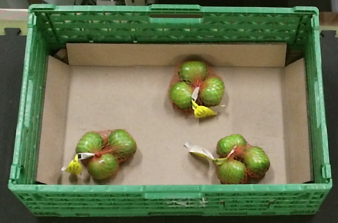
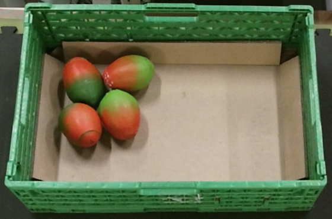
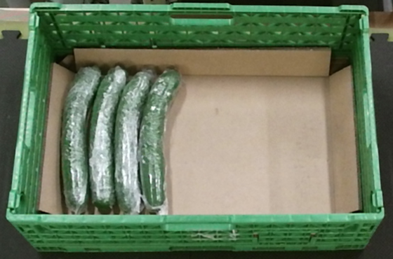
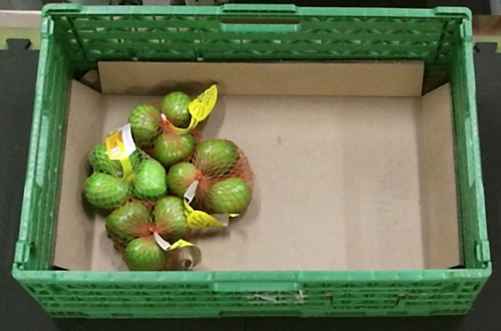
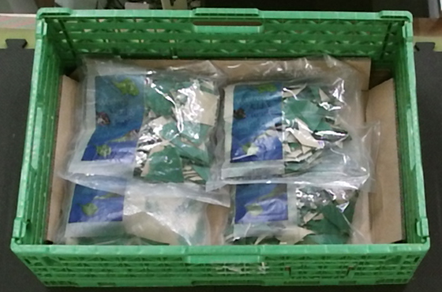

# A Benchmarking Framework for Systematic Evaluation of Robotic Pick-and-Place Systems in an Industrial Grocery Setting

This repository accompanies our paper: *A Benchmarking Framework for Systematic Evaluation of Robotic Pick-and-Place Systems in an Industrial Grocery Setting*. More specifically, it contains the following information:

* Description of how to replicate the environment in which the proposed benchmark is performed.
* Information and materials pertaining to the object set of the benchmark.
* Detailed instructions on how to perform the benchmark in a repeatable fashion, thus guaranteeing the repeatability of results.

If you use our framework, please cite our work:

```
@inproceedings{Triantafyllou19,
 author={P. Triantafyllou and H. Mnyusiwalla and P. Sotiropoulos and M.A. Roa and D. Russell and G. Deacon},
 title={A Benchmarking Framework for Systematic Evaluation of Robotic Pick-and-Place Systems in an Industrial Grocery Setting},
 booktitle={Proc. IEEE Int. Conf. Robotics and Automation},
 location={Montreal, Canada},
 year={2019}
}
```

## Setup description

The setup of the framework consists of a storage and a delivery crate. The crates can be any type of container with an opening of 60 x 40 cm. The storage crate must also have a height of 
approximately 20 cm. In our experiments, we used a Green Plus 6416 IFCO container.

The positioning of the robot and crates in the setup is considered as part of the system’s engineering, and can vary between systems, as it highly depends on the kinematics of the robotic system
and the available workspace. However, in order to ensure comparability of the results, a minimum distance of 20 cm between the closest points of the storage and the delivery crate should be 
respected during the setup design process. The pose of the storage and the delivery crate should be fixed w.r.t. a static coordinate frame, and should be reported.



In the SoMa project, design of environmental constraints (EC) has been explored to enhance the system’s performance. As the initial motivation for this work was to evaluate the SoMa system, 
in the proposed setup we have modified the storage crate in the following ways:

* We have introduced ramps at the edges of the crate's surface, thus adding an extra exploitable EC.
* We have used a cardboard inlay to create the ramps, thus offering a smooth homogeneous-friction surface which helps avoid the challenges of the performated crate surface.

Even though further EC designs could be explored, in order to reduce the confounding variables of our benchmark, we consider the aforementioned modifications as a fixed part of the storage crate
environment.

<br clear="right"/>

### How to build the EC design

The aforementioned EC design must be built using C-Flute single wall corrugated cardboard following the instructions illustrated below :



* Cut a piece of cardboard with approximate dimensions 52 x 72 cm.
* Remove 4 squares sized 9.5 x 9.5 cm each from its corners.
* Carve the cardboard along the red lines shown on the picture on the right.
* Flip the cardboard.
* Carve the cardboard along the blue lines shown on the picture on the right.
* Bend the carboard along the carved lines and place it inside the storage crate.

<br clear="right"/>

## Object set

The object set for this framework comprises four objects: netbag of limes, mango, loose leaf salad bag, and cucumber. For the sake of reproducibility and waste reduction, we have created a set 
of surrogate objects to perform the experiments. These are as close as possible to the real ones in both weight and appearance, as illustrated below:



### How to build the object set

The surrogate mangos, cucumbers and limes can be 3D printed. 3D models and weight information are provided in the following table:

| Object  | CAD model | Weight |
| ------------- | ------------- | ------------- |
| Mango  | [Mango.stl](cad_files/Mango.stl)  | 180 - 220 g |
| Cucumber  | [Cucumber.stl](cad_files/Cucumber.stl)  | 160 - 200 g |
| Lime  | [Lime.stl](cad_files/Lime.stl)  | 40 - 50 g |

One can reach the desired weight in two ways:

* Adjusting the infill percentage.
* Printing just the object shell (3-4 layers should be enough) and then filling it.

We followed the latter procedure. We printed the object shells using [this filament](https://colorfabb.com/leaf-green), cut a small opening, filled the objects with general-purpose silicone until
they reached a satisfactory weight and then glued back the cut-out pieces.

It should be noted that the netbag of limes contains 3 limes, so the total weight of the object should be 120 - 150 g. Netbags of limes or lemons should be easily found in any grocery store. These
netbags are usually clipped in two places. Releasing one of the clips with a pair of pliers, replacing the real fruit with the surrogate ones and reclipping should be straightforward.

As far as the loose leaf salad bags are concerned, they have an approximate size of 17 x 17 cm and weigh around 220 g. If one can't find an airtight plastic bag of that size, then one can build it
by cutting and heat-sealing plastic sheets. The bags should be filled with shredded paper and one should try to keep as much air in them as possible.

Finally, one must attach non-transparent labels on netbags and salad bags. More information is provided below:

| Object | Label shape | Label dimensions | Label position |
| ------------- | ------------- | ------------- |------------- |
| Netbag of Limes | Ellipsoid | 3 x 5 cm | Clipped on the netbag |
| Salad bag | Rectangular | 16 x 8 cm | Left side of the salad bag |

## Definition of scenarios

We introduce 7 predefined scenarios that are a subset of the possible configurations of the objects within a storage crate. The scenarios span different levels of scene complexity, from
simple to relatively cluttered scenes. Accurate and repeatable positioning of the objects can be performed in one of the following ways depending on the scenario: i) following simple positioning
rules, and ii) using [A4 size stencils](images/stencils/). The stencils feature numbered circular markers for objects to be placed on according to instructions accompanying each scenario.
[The images of the scenarios](images/Scenario_images/) can be used as guideline to remove any ambiguity in object positioning. The following table summarizes information about scenarios and
object positioning:


| Scenario No.  | No. of objects | Difficulty | Stencils provided? | Positioning instructions| Scenario image |
| ------------- | ------------- | ------------- | ------------- | ------------- | ------------- |
| 1  | 3 | Easy | Yes | The position of each mango is defined by two circular markers. The bottom of the mango must be placed on the lower-numbered marker and the top of the mango on the other marker. | |
| 2  | 3 | Easy | Yes | The position of each cucumber is defined by two circular markers, one for each of its ends. All cucumbers in the scene must face the same way. | |
| 3  | 3 | Easy | Yes | The position of each netbag is defined by three circular markers. Place on lime on each marker such that the short principal axis of the lime is approximately going through the center of the netbag. | |
| 4  | 4 | Hard | Yes | The position of each mango is defined by two circular markers. The bottom of the mango must be placed on the lower-numbered marker and the top of the mango on the other marker. | |
| 5  | 4 | Hard | No | Place the cucumbers as shown in the scenario image. The first cucumber is placed exactly next to the ramp. | |
| 6  | 4 | Hard | Yes | The position of each netbag is defined by three circular markers. Place on lime on each marker such that the short principal axis of the lime is approximately going through the center of the netbag. | |
| 7  | 4 | Hard | No | Place the salads as shown in the scenario image. The first salad is placed exactly next to the ramp. | |

## Contact

For more information or if you need any help, please contact [p.triantafyllou@ocado.com](mailto:p.triantafyllou@ocado.com).
